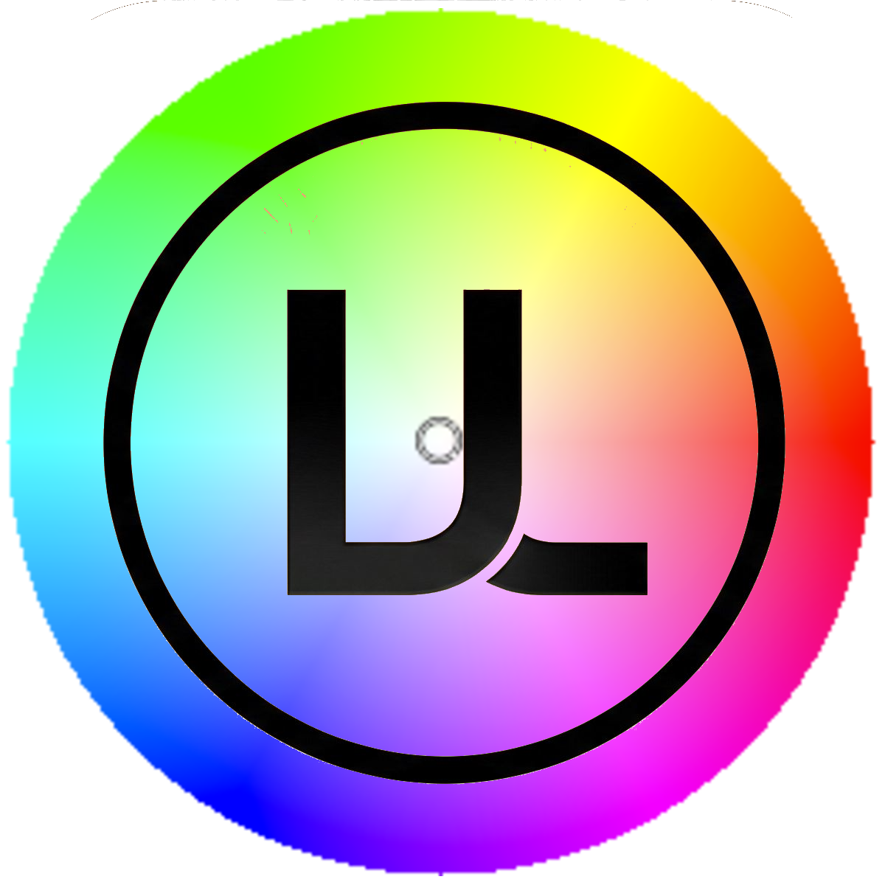
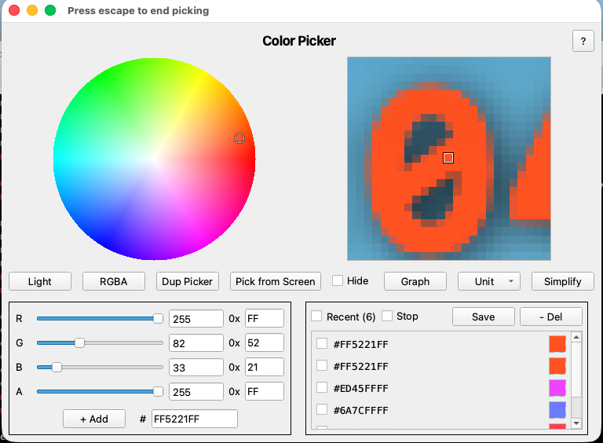
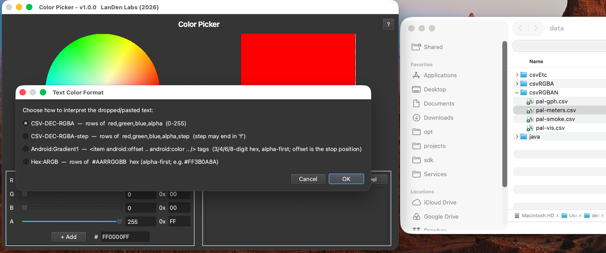
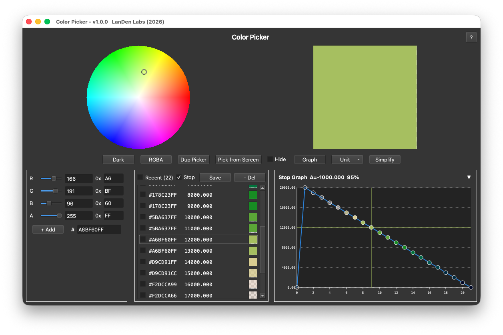
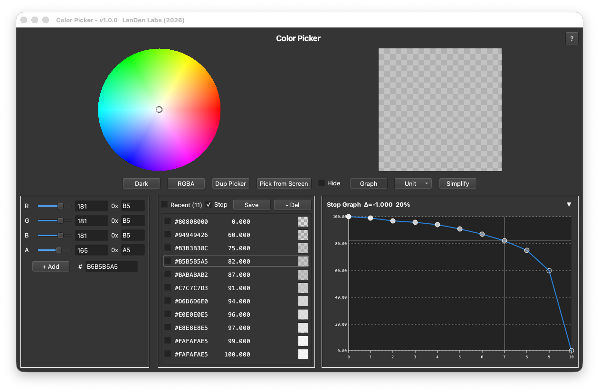
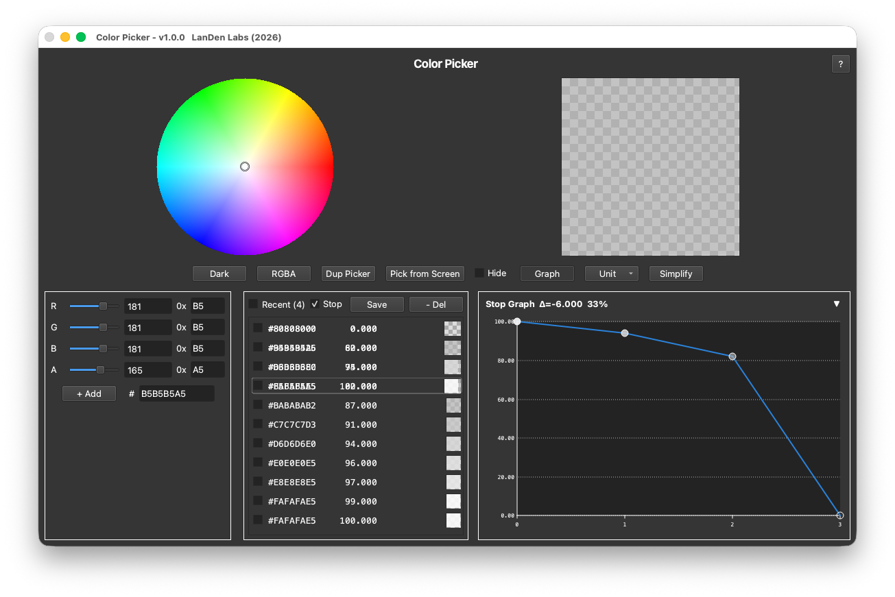
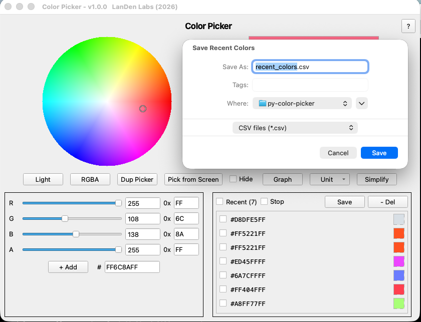

<table border="0">
  <tr>
    <td>
      <!-- VERSION -->v1.0.0<br>
      <!-- DATE -->09-Jul-2026<br>
      macOS &nbsp;|&nbsp; Windows &nbsp;|&nbsp; Linux<br>
      <a href="https://landenlabs.com">Home</a>
    </td>
    <td>
      <a href="https://landenlabs.com">
        
      </a>
    </td>
  </tr>
</table>



# Color Picker

A Qt color picker with a hue/saturation wheel, R/G/B/A channel sliders, hex entry,
screen-pixel sampling, and a scrollable recent-colors list with gradient stop support.

**By [LanDen Labs](https://github.com/landenlabs) (2026)**

---

## Screenshots

**Pick from Screen**



The magnified viewer follows the cursor while picking, with a crosshair over the exact
pixel that will be sampled.

---

**Drop or paste color data**



Dragging a file (or pasting text) onto the color swatch prompts you to choose how to
interpret it — CSV-DEC-RGBA, CSV-DEC-RGBA-step, Android gradient XML, or alpha-first hex.

---

**Gradient stop graph**



Gradient colors (red, green, blue, alpha, value) can be plotted as a line graph, useful
for visualizing how a palette's channels and stop values change across the gradient.

---

**Simplify gradient data**

Gradients can be simplified by removing intermediate stop values that don't materially
change the interpolated result.

| Before | After |
| --- | --- |
|  |  |

---

**Save palette**



Color palettes can be saved to a CSV file and are also placed on the paste buffer
(clipboard), so they're immediately available to paste elsewhere without opening the
saved file.

---

## Features

- **Color wheel.** Interactive hue/saturation wheel; click or drag to pick a color.
  Value (brightness) is controlled separately via the V slider.
- **R/G/B/A channel rows.** Each channel has a slider, a decimal spinbox, and a
  two-digit hex field — all stay in sync as you edit any of them.
- **Screen-pixel sampler.** Freeze the screen, hover to preview a magnified patch,
  click to pick a single color or pick multiple colors before dismissing.
- **Recent colors list.** Scrollable list (up to 256 entries) showing `#RRGGBBAA`
  hex, a mini swatch, and an optional gradient-stop value column. Supports
  bulk-delete of checked rows and CSV export.
- **Gradient stop graph.** Collapsible line graph that plots stop values from the
  recent-colors list — useful for inspecting palette distributions.
- **Palette extraction from dropped or pasted images.**
  - Qt Index Image (256 colors via Qt quantization).
  - Histogram method (N most-popular colors with fuzzy shade merging; 16/64/256).
- **OCR palette import** (requires Pillow + pytesseract):
  - SSDS Color Palette — extracts Step/A/R/G/B from a screenshot.
  - Pangea Color Palette — extracts step and R,G,B,A per row from a screenshot.
- **Text / file palette import:**
  - CSV-DEC-RGBA — rows of `red,green,blue,alpha` (0–255).
  - CSV-DEC-RGBA-step — rows of `red,green,blue,alpha,step`.
  - Android Gradient XML — `<item android:offset … android:color … />` tags.
  - Hex:ARGB — rows of `#AARRGGBB` hex (alpha-first).
  - SSDS-JSON — parse Step/ARGB from a `.json` palette file.
- **RGBA / ARGB display modes.** Toggle between `#RRGGBBAA` and `#AARRGGBB` hex
  ordering in the recent list (mirrors Android's alpha-first convention).
- **Light / Dark themes** — Fusion style with a full QPalette dark mode.
- **Persistent settings** — window geometry, theme, and recent-color list
  are saved via QSettings and restored on next launch.

---

## Requirements

- Python 3.9 or later
- PyQt6
- Pillow + pytesseract (optional — required for OCR palette import)
- matplotlib (optional — enhances the histogram dialog)

```bash
pip install -r requirements.txt
```

---

## Installation

### Run from source

```bash
git clone https://github.com/landenlabs/color-picker.git
cd color-picker
python color-picker.py
```

### Build a standalone binary

**macOS / Linux**

```bash
pyinstaller --onefile --name color-picker color-picker.py
```

**Windows**

```powershell
pyinstaller --onefile --name color-picker color-picker.py
```

Both commands use [PyInstaller](https://pyinstaller.org) to produce a self-contained executable.

Pushing a `v*` tag (e.g. `v1.0.0`) triggers `.github/workflows/build.yml`, which builds
macOS and Windows binaries and publishes them to a GitHub Release automatically.

---

## Usage

### Launch the GUI

```bash
python color-picker.py
```

The window opens with a red default color. Use the wheel, sliders, or hex fields to
select a color. Press the eyedropper button to sample a pixel from anywhere on screen.

### Pick colors from a palette image

Drag an image file (PNG, JPG, etc.) onto the color swatch. A dialog lets you choose
the extraction method (Qt quantization, histogram, SSDS OCR, Pangea OCR, or SSDS JSON).
Extracted colors are added to the Recent list.

### Import colors from text

Drag a `.txt` or `.csv` file (or paste text) onto the color swatch. A format-choice
dialog lets you select the correct layout (CSV-DEC-RGBA, Android gradient, Hex:ARGB, etc.).

### Export recent colors

Click **Save** in the Recent list header to write all current colors to a CSV file
(`#RRGGBBAA,R,G,B,A` per row, with an optional stop column).

---

## Project structure

```
color-picker/
├── color-picker.py             # Main script (single-file GUI)
├── version.py                  # Version string (__version__)
├── VERSION                     # Bare X.Y.Z, mirrors version.py
├── set-version.bash            # Bump version, commit, tag, push (macOS/Linux)
├── set-version.ps1             # Bump version, commit, tag, push (Windows)
├── icon.png                    # App icon: title bar, Dock/taskbar, About dialog, README
├── icon.icns                   # App icon baked into the macOS release build
├── icon.ico                    # App icon baked into the Windows release build
├── make-icons.bash             # Regenerate icon.icns/icon.ico from icon.png (macOS/Linux)
├── make-icons.ps1              # Regenerate icon.icns/icon.ico from icon.png (Windows)
├── make_icons.py               #   shared Pillow-based generator used by both
├── requirements.txt
├── README.md
├── LICENSE
├── screens/                    # Images used in this README
└── .github/workflows/build.yml # Tag-triggered build + GitHub Release
```

---

## Releasing

Versions are bumped with `set-version.bash` (or `set-version.ps1` on Windows), run from
the repo root:

```bash
./set-version.bash -version 1.0.1 -message "Fix gradient-stop unit conversion"
```

This updates `VERSION`, `version.py` (`__version__`), and the `<!-- VERSION -->` /
`<!-- DATE -->` markers in this README, then commits, tags, and pushes — the push of the
`vX.Y.Z` tag triggers the release build above. The in-app "Built" date (About dialog) is
derived from `version.py`'s file timestamp, so it tracks the last version bump.

---

## License

Apache 2.0 © [LanDen Labs](https://github.com/landenlabs) 2026
